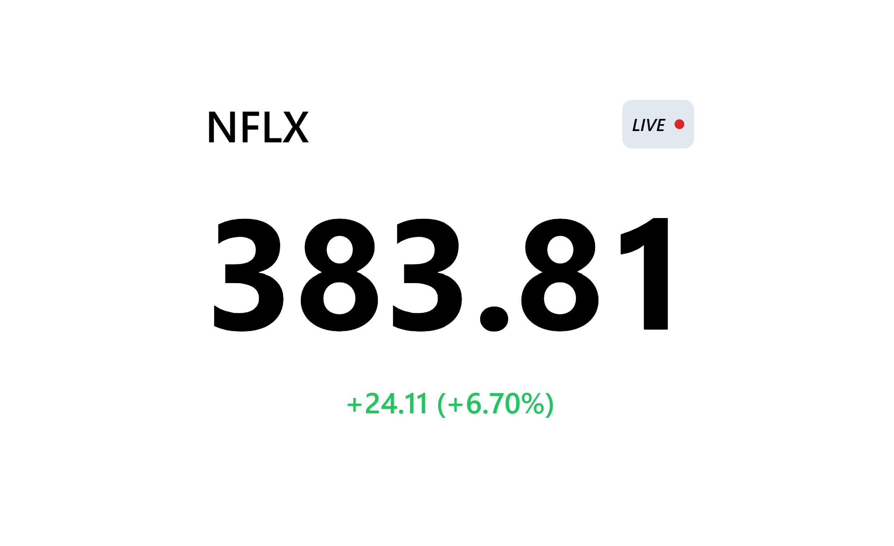

# Live Stockticker using Yahoo Finance data

I recently discovered that the [Yahoo Finance](https://finance.yahoo.com) website uses a public [API](wss://streamer.finance.yahoo.com/) to get live market data into the frontend. After some more digging, it became obvious this was done using [WebSockets](https://developer.mozilla.org/en-US/docs/Web/API/WebSockets_API) and [ProtoBuf](https://developers.google.com/protocol-buffers), both of which I wanted to get a feeling for anyway. So, I decided to build a simple price tracker in order to get familiar with the technologies used.

The project is a simple React App, scaffolded with [create-react-app](https://create-react-app.dev/).

## Installation

    $ git clone https://github.com/nils-jansen/stockticker.git
    $ cd stockticker
    $ npm install

## Usage

    $ npm start

Enter a stock symbol as used on [finance.yahoo.com](https://finance.yahoo.com/lookup) and wait for the first message from the WebSocket connection.

The file "[yaticker_pb.js](src/util/yaticker_pb.js)" was generated with [protoc](https://github.com/protocolbuffers/protobuf/releases), using the .proto file available at [github.com/yahoofinancelive/yliveticker](https://github.com/yahoofinancelive/yliveticker/blob/master/yliveticker/yaticker.proto).
